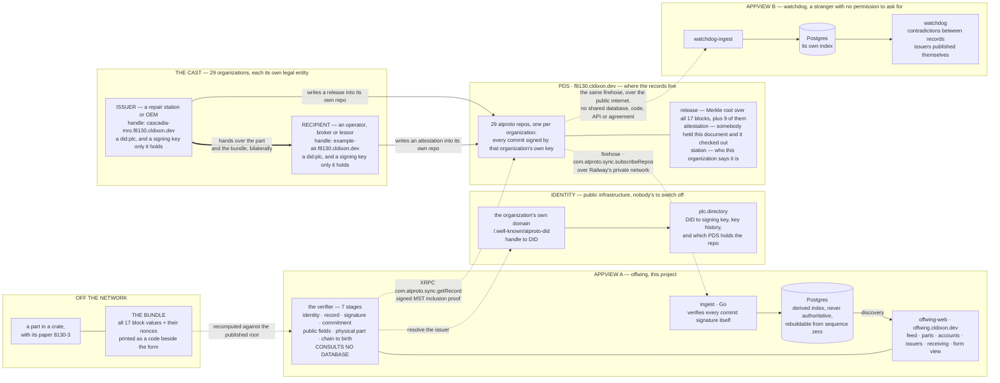

# Offwing: 8130 certificates on AT Protocol

⚠️ THIS IS A PROOF-OF-CONCEPT FOR DEMONSTRATION ONLY. ALL DATA IS SYNTHETIC.

**Offwing** is a demonstration of the AT Protocol applied to solve interesting problems beyond social media apps.

You can explore the [live app](https://offwing.cldixon.dev) to try it out and read the [blog post](https://cldixon.com/blog/offwing) for more context.


that FAA 8130-3 Authorized Release Certificates, and the
back-to-birth traceability behind them, can be made cryptographically
verifiable using AT Protocol as the identity, storage, and distribution
layer — while disclosing none of the commercially sensitive contents.

## The idea

**Publish a commitment, deliver the document.**

The real failure mode in aviation parts fraud is not tampering with shared
records. It is forgery at the source: documents attributed to real, reputable
repair stations that never issued them. So a repair station's atproto handle
*is* its domain, DNS-verified, and its records are signed by keys in its DID
document. A release certificate is valid only if a matching commitment record
exists in the issuer's own repo. Forging one requires compromising the
station's domain *and* its signing key, not editing a PDF.

The commitment covers **every block of the form** — a Merkle root over all
seventeen. The public record carries nine of them, enough to find a record and
know who signed it. The rest, including Block 11 (what was done) and Block 12
(what the shop found), travel bilaterally as a "bundle," exactly as paperwork
moves today. Anyone can verify authorship and integrity; nobody learns the
commercially sensitive content.

Completeness stays public even when contents are not. Each release links its
predecessor, so a seller can withhold a document but cannot hide that the
chain fails to reach birth.

The **form view** puts one record in three notations side by side: the
8130-3 as a shop would recognise it, the AT Protocol record as published, and
the commitment tree. Click a block and its leaf folds up to the published root.
Without a bundle, nine blocks have values and eight say *withheld* — which is
the design, drawn.

[**docs/commitments.md**](docs/commitments.md) works the cryptography through
from first principles — a four-field toy tree with reproducible hashes, why the
nonces are not optional, how one field is opened against the published root
without the issuer's involvement, and what the scheme still cannot do.

## Only positive claims

The network carries one statement about a document — that somebody held it and
it checked out — and deliberately has no counterpart for a failure.

That is not squeamishness. **A mismatch cannot be proven to a third party.** To
show that a document does not recompute you would have to reveal the document,
and a document that fails proves only that *some* document fails — anyone can
produce one. Selective disclosure proves a value is under a commitment; there
is no symmetric move for proving one is not. A public rejection would
therefore be an unprovable accusation of fraud against a named business,
published by a party with a commercial interest in the outcome. No reputable
operator would touch it, and a system that invites it is a defamation engine
rather than a transparency tool.

So an operator who cannot verify a certificate takes it up with the station
privately, exactly as they do now. The absence of attestations on a station's
releases is weak evidence and nothing more, which is the correct strength for
it — most checks in a real supply chain are never announced at all.

What is left turns out to be the stronger material. A station cannot decline to
participate in a check it is not being asked to make, so arithmetic over what
issuers published themselves — one serial with two origin claims, a history
that stops at a record nobody can produce — needs nobody's cooperation.

## Receiving a part

Issuing is half of it. The other half is somebody on a loading dock with a
crate, and the demonstration models that end too.

A release hands the part to a recipient along with the paperwork — in the
model, the bundle travels in the box, as a code printed beside the form. That
is the only way a receiver could ever open the withheld blocks, and it costs
nothing: the paper already has all seventeen printed on it, so a code carrying
the same values reveals nothing to anyone holding the crate that the crate did
not already reveal.

**Receiving** is then one page in three states. The scanned certificate, drawn
as the form. The seven checks, running. The outcome, appended below rather
than replacing what came before, so the whole thing can be scrolled back
through afterwards.

The checks are real — the issuer's DID resolved, their repository fetched, the
commit signature verified against the key their DID document declares, the
document recomputed against the commitment. What is spared the visitor is the
typing, not the arithmetic. A third of arrivals carry an altered field, so
both outcomes are reachable without hunting for one.

A failure teaches which half of the form it landed in. A public block can be
named outright — the record says one thing, the crate says another. A withheld
block cannot: the commitment is a single hash over all seventeen and does not
decompose, so the honest answer is that the document is not the one that was
published and nobody can say which line changed. That second case is the one
people find surprising and it is the shape of the guarantee.

A document that checks out can be attested to, optionally. A document that
does not offers nothing to publish, for the reason above.


## The lexicon

<!-- TODO: prose. -->

Three record types, all under `dev.cldixon.f8130`. Descriptions are elided
here; the full definitions, which carry the reasoning for every field, are in
[`lexicons/`](lexicons/dev/cldixon/f8130).

**`release`** — the public commitment to one 8130-3. A Merkle root over all
seventeen committed blocks, plus the nine of them needed to find the record and
know who signed it. The form itself never appears.

```json
{
  "lexicon": 1,
  "id": "dev.cldixon.f8130.release",
  "defs": { "main": {
    "type": "record",
    "key": "tid",
    "record": {
      "type": "object",
      "required": ["commitment", "issuerDid", "approvingAuthority", "formNumber",
                   "organizationName", "organizationAddress", "description",
                   "partNumber", "serialNumber", "signerCert", "completedAt"],
      "properties": {
        "commitment":          { "type": "bytes",   "minLength": 32, "maxLength": 32 },
        "fieldSetVersion":     { "type": "integer", "minimum": 1 },
        "issuerDid":           { "type": "string",  "format": "did" },
        "prev":                { "type": "ref",     "ref": "com.atproto.repo.strongRef" },
        "subject":             { "type": "string",  "maxLength": 512 },
        "approvingAuthority":  { "type": "string",  "maxLength": 128 },
        "formNumber":          { "type": "string",  "maxLength": 128 },
        "organizationName":    { "type": "string",  "maxLength": 256 },
        "organizationAddress": { "type": "string",  "maxLength": 512 },
        "description":         { "type": "string",  "maxLength": 256 },
        "partNumber":          { "type": "string",  "maxLength": 128 },
        "serialNumber":        { "type": "string",  "maxLength": 128 },
        "signerCert":          { "type": "string",  "maxLength": 128 },
        "completedAt":         { "type": "string",  "format": "datetime" }
      }
    }
  }}
}
```

| field | 8130-3 block | |
|---|---|---|
| `approvingAuthority` | 1 | approving civil aviation authority and country |
| `formNumber` | 3 | form tracking number |
| `organizationName`, `organizationAddress` | 4 | the issuing organization — already implied by whose repo this is |
| `description` | 7 | what the item is |
| `partNumber` | 8 | |
| `serialNumber` | 10 | |
| `signerCert` | 13c / 14c | the approval or certificate number released under |
| `completedAt` | 13e / 14e | claimed completion — attacker-controlled, compare against an observer's own clock |

The other eight committed blocks are not here and that is the design — Block 5
(work order), 6 (item), 9 (quantity), 11 (status), 12 (remarks), 13/14 (which
certifying block was used), 13a/14a (approval basis) and 13d/14d (signer name).
The commitment covers all seventeen; the record publishes nine.

`prev` is a strong reference to the previous shop visit for the same serial, so
the chain can be walked backwards and each link pinned by CID. Absent means
birth — which is why whether a record claims to be a birth record stays
publicly inferable however the rest of the split is drawn.

**`attestation`** — somebody held the paper, ran the check, and it passed.
Written into the checker's own repo, so the issuer cannot suppress it. There is
deliberately no counterpart for a failure.

```json
{
  "lexicon": 1,
  "id": "dev.cldixon.f8130.attestation",
  "defs": { "main": {
    "type": "record",
    "key": "tid",
    "record": {
      "type": "object",
      "required": ["subject", "verifiedAt", "synthetic"],
      "properties": {
        "subject":    { "type": "ref",    "ref": "com.atproto.repo.strongRef" },
        "verifiedAt": { "type": "string", "format": "datetime" },
        "synthetic":  { "type": "string", "maxLength": 200 }
      }
    }
  }}
}
```

`subject` is a strong reference rather than a bare URI because the CID pins the
exact bytes that were checked: the attestation cannot be read as covering a
later, different record at the same URI.

**`station`** — an organization's self-published profile, so an AppView learns
the cast by reading the network instead of from a table it shipped. Nothing
here is committed to by any release: what a shop calls itself is not a property
of the work it certified.

```json
{
  "lexicon": 1,
  "id": "dev.cldixon.f8130.station",
  "defs": { "main": {
    "type": "record",
    "key": "literal:self",
    "record": {
      "type": "object",
      "required": ["displayName", "kind", "synthetic"],
      "properties": {
        "displayName": { "type": "string", "maxLength": 128 },
        "kind":        { "type": "string", "knownValues": ["oem", "mro", "operator", "broker", "lessor"] },
        "cage":        { "type": "string", "maxLength": 32 },
        "certificate": { "type": "string", "maxLength": 64 },
        "synthetic":   { "type": "string", "maxLength": 200 }
      }
    }
  }}
}
```

Every record type carries a required `synthetic` marker, and `release` carries
it in the bundle rather than the schema. Nothing published here can be mistaken
for an airworthiness record by a reader who parses it.

## Architecture

Every entity in the demonstration, and every wire between them.



Reading the key:

| | |
|---|---|
| **solid** | a write, by the organization whose key signs it |
| **dotted** | a read, over a published protocol surface and nothing else |
| **thick** | the physical handover — no network involved, and no AppView ever sees it |

Three things the diagram is drawn to make load-bearing:

**Nothing to the right of the PDS reads its disk.** `ingest` and `offwing-web`
run in the same Railway project as the PDS and still take only the firehose and
XRPC. Break that once and the demonstration becomes a normal database with
extra steps.

**The index and the verifier are independent.** Browsing — what parts exist,
who has vouched for them — needs `ingest` to have seen the record. Verification
needs nothing but the internet: it resolves the handle, asks that issuer's own
server for signed bytes, recomputes the commitment from the document in your
hand, then follows `prev` references to birth across whatever servers the chain
spans. That is why the app still verifies documents correctly with
`DATABASE_URL` unset.

**AppView B is not a component of this system.** It shares the record schemas
and nothing else — no database, no code, no API, no agreement — and reaches the
firehose over the public internet like any stranger would, because it is one. A
release can verify cleanly in A while B sees the same part and serial claimed as
new by two different stations. Both readings are correct, and no platform
arbitrates between them.

## Status

Complete as a demonstration. Built:

| | |
|---|---|
| `lexicons/` | `release`, `attestation`, `station` record schemas |
| `core/` | TypeScript commitment core and the seven-stage verification pipeline |
| `commitment/` | Go implementation of the same commitment scheme |
| `ingest/` | firehose consumer, signature verification, derived Postgres index |
| `cmd/ingest/` | `run` and `reindex` commands |
| `web/` | the AppView — feed, receiving, form view, part timeline, accounts, issuers, what-this-is, JSON API |
| `seed/` | one-shot job: 29 fictional organizations and the eight set pieces |
| `watchdog/` | AppView B — an independent reader with its own index and its own questions |
| `testdata/vectors.json` | the cross-language contract both cores must satisfy |
| `spike/` | validation that the atproto verification primitives hold up |
| `docs/commitments.md` | the commitment scheme explained, with worked examples |

Running live on Railway with real repositories, real signing keys and real
`did:plc` identities, both AppViews reading them, issuance and attestation
through the UI, and selective disclosure. Every milestone from the original
plan is built.

Deliberately not built, and documented as gaps rather than quietly fixed:
individual counter-signing, aircraft logbooks, revocation, and nonce
custody — see [Known gaps](#known-gaps).

Run it from a fresh clone with nothing installed and nothing deployed:

```bash
npm install
npm run dev                             # http://localhost:3000
curl localhost:3000/demo/bundles.json   # genuine · birth · tampered · forged
```

Demo mode serves an in-memory network of real repositories with real signing
keys and real inclusion proofs. Paste the `tampered` bundle into the verify
page to see the moment the design is built around: a genuine signature beside
a commitment that no longer matches.

Tests, the cross-language vector contract, the design system and the rules that
are not negotiable: [DEVELOPMENT.md](DEVELOPMENT.md). Deploying it:
[DEPLOYMENT.md](DEPLOYMENT.md).

## Deployment

Eight services in one Railway project:

| service | role | address |
|---|---|---|
| `pds` | the stations' repositories — the data | `f8130.cldixon.dev` |
| `ingest` | firehose consumer; verifies every commit signature | private |
| `Postgres` | derived index, rebuildable from the firehose | private |
| `offwing-web` | AppView A — feed, receiving, verify, trace | [offwing.cldixon.dev](https://offwing.cldixon.dev) |
| `seed` | one-shot job; provisions accounts and scenarios | — |
| `watchdog-ingest` | AppView B's own consumer, over the **public** firehose | private |
| `Postgres-8BEk` | AppView B's own index | private |
| `watchdog` | AppView B — contradictions between published records | [watchdog-production-7c07.up.railway.app](https://watchdog-production-7c07.up.railway.app) |

The two AppViews share the record schemas and nothing else: no database, no
code, no API, no agreement. AppView B connects to
`wss://f8130.cldixon.dev` over the public internet rather than through
Railway's private network, because a reader with privileged access would not
be demonstrating anything. It backfills from the start of the log, so it can
join late and still see everything.

The two answer different questions and no platform arbitrates between them. A
release verifies **cleanly in A** — the certificate really was signed by the
organization claiming it — while B can see that the same part and serial is
claimed as new by two different stations, which is a contradiction neither
record admits on its own. Both readings are correct.

B accuses nobody. It reports arithmetic over what issuers published
themselves: serials with more than one origin claim, histories that stop at a
record nobody can produce, and how much of each issuer's output anybody has
independently vouched for — as two numbers rather than a score, because thin
coverage usually means nobody got round to publishing a check.

`f8130.cldixon.dev` serves the AT Protocol PDS, not a user interface — that
separation is the point. The five handles are subdomains of it, so
`northwind-turbine.f8130.cldixon.dev/.well-known/atproto-did` returns that
organization's DID.

**A deployment with no environment variables set comes up correct.** That is a
deliberate property, not luck. Recreating a Railway service silently drops every
variable it had, and the first time that happened here the app booted green,
served every page, and failed every verification — because it was pointed at the
real network with no PDS behind it. Broken-but-healthy-looking is the worst
failure mode available, so the zero-configuration case is now the default and is
covered by tests.

| variable | default | effect |
|---|---|---|
| `F8130_MODE` | `demo`, or `live` when `DATABASE_URL` is set | which network to read |
| `DATABASE_URL` | unset | enables browsing; verification never needs it |
| `PDS_INTERNAL_URL` | unset | where to sign; without it the app is read-only |
| `SEED_ACCOUNT_PASSWORD` | unset | the demonstration accounts' password, for signing |
| `ANTHROPIC_API_KEY` | unset | narrates Blocks 7 and 12; falls back to the catalogue |
| `F8130_ACTIVITY` | on in demo, off in live | the synthetic generator; `1` forces on, `0` off |
| `PORT` / `HOST` | `3000` / `::` | IPv6 first, falls back to IPv4 |
| `PLC_URL` | `plc.directory` | identity directory, live mode only |
| `PDS_HOSTNAME` | `f8130.cldixon.dev` | the domain the roster's handles sit under |
