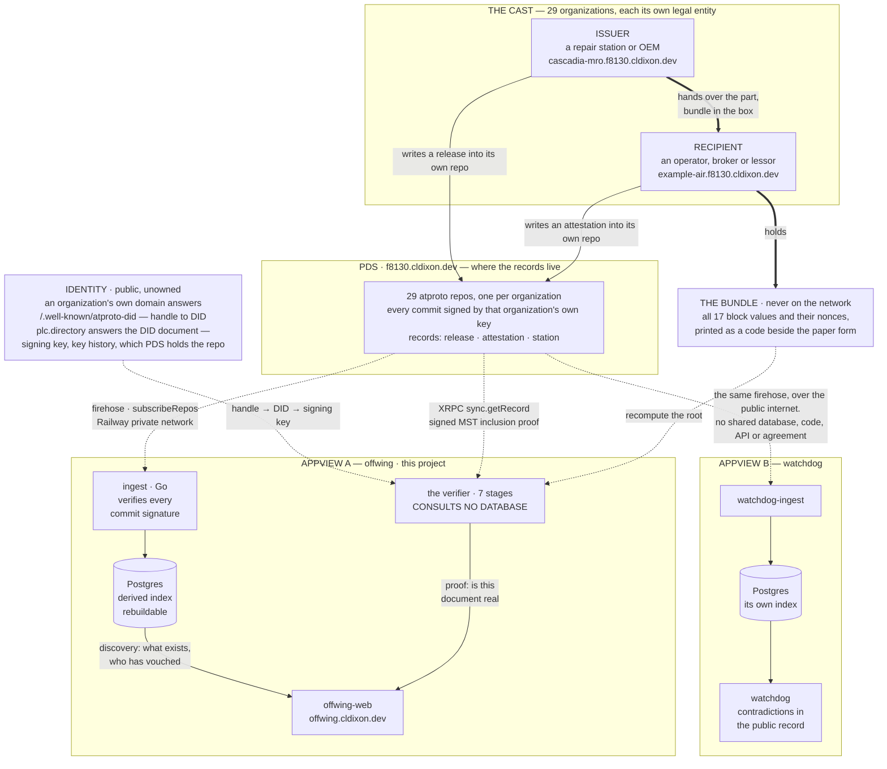

# Offwing: 8130 certificates on AT Protocol

⚠️ THIS IS A PROOF-OF-CONCEPT FOR DEMONSTRATION ONLY. ALL DATA IS SYNTHETIC.

**Offwing** is a demonstration of building on AT Protocol to solve interesting problems beyond social media apps.

You can explore the [live app](https://offwing.cldixon.dev) to try it out and read the [blog post](https://cldixon.com/blog/offwing) for more background.

## The problem 

Whenever parts are removed from an aircraft and shipped to outside repair vendors, they must be tracked with an accompanying FAA 8130-3 document (or variation depending on regulatory authority). When a part is sold on secondary markets, its entire history must be accounted for by its lineage of these documents. Yet, most players in the aviation maintenance industry keep these documents in paper and PDF formats. 

At best, this leads to inefficiencies and unavailability of critical data for operators. In worse cases, it has been susceptible to fraud and fabrication. One challenge is that these documents do include some amount of propietary information, such as notes on the repairs taken and outcome. Neither the repair vendor nor the operators want this information to be publicly visible. Other information in the documents, such as part number, serial number, etc., could be made public and are essential later in the verifying a part has all of its historical 8130 documents accounted for.

This application provides a proof of concept for a decentralized, secure, and transparent solution to this problem. The AT Protocol provides a way for participants to share information while maintaining ownership and privacy for sensitive propietary data. Cryptographic signatures are generated from the data entered into a released 8130 certifiacts and published onto a public network under the identify of the vendor in possession of the part. 

When the receiver inspects the returned parts package, they can verify the included 8130 paper copy matches the original record from the sender. Optionally, the recipient has the ability to publicly attest to the record, which provides positive signal to the network for distinguishing valid activity from fraudulent behavior.


## At Proto architecture

Every entity in the demonstration, and every wire between them.




## The lexicon


Three record types, all under `dev.cldixon.f8130`. Descriptions are elided
here; the full definitions, which carry the reasoning for every field, are in
[`lexicons/`](lexicons/dev/cldixon/f8130).

**`release`** — the public commitment to one 8130-3. A Merkle root over all
seventeen committed blocks, plus the nine of them needed to find the record and
know who signed it. The form itself never appears.

```json
{
  "lexicon": 1,
  "id": "dev.cldixon.f8130.release",
  "defs": { "main": {
    "type": "record",
    "key": "tid",
    "record": {
      "type": "object",
      "required": ["commitment", "issuerDid", "approvingAuthority", "formNumber",
                   "organizationName", "organizationAddress", "description",
                   "partNumber", "serialNumber", "signerCert", "completedAt"],
      "properties": {
        "commitment":          { "type": "bytes",   "minLength": 32, "maxLength": 32 },
        "fieldSetVersion":     { "type": "integer", "minimum": 1 },
        "issuerDid":           { "type": "string",  "format": "did" },
        "prev":                { "type": "ref",     "ref": "com.atproto.repo.strongRef" },
        "subject":             { "type": "string",  "maxLength": 512 },
        "approvingAuthority":  { "type": "string",  "maxLength": 128 },
        "formNumber":          { "type": "string",  "maxLength": 128 },
        "organizationName":    { "type": "string",  "maxLength": 256 },
        "organizationAddress": { "type": "string",  "maxLength": 512 },
        "description":         { "type": "string",  "maxLength": 256 },
        "partNumber":          { "type": "string",  "maxLength": 128 },
        "serialNumber":        { "type": "string",  "maxLength": 128 },
        "signerCert":          { "type": "string",  "maxLength": 128 },
        "completedAt":         { "type": "string",  "format": "datetime" }
      }
    }
  }}
}
```

| field | 8130-3 block | |
|---|---|---|
| `approvingAuthority` | 1 | approving civil aviation authority and country |
| `formNumber` | 3 | form tracking number |
| `organizationName`, `organizationAddress` | 4 | the issuing organization — already implied by whose repo this is |
| `description` | 7 | what the item is |
| `partNumber` | 8 | |
| `serialNumber` | 10 | |
| `signerCert` | 13c / 14c | the approval or certificate number released under |
| `completedAt` | 13e / 14e | claimed completion — attacker-controlled, compare against an observer's own clock |

The other eight committed blocks are not here and that is the design — Block 5
(work order), 6 (item), 9 (quantity), 11 (status), 12 (remarks), 13/14 (which
certifying block was used), 13a/14a (approval basis) and 13d/14d (signer name).
The commitment covers all seventeen; the record publishes nine.

`prev` is a strong reference to the previous shop visit for the same serial, so
the chain can be walked backwards and each link pinned by CID. Absent means
birth — which is why whether a record claims to be a birth record stays
publicly inferable however the rest of the split is drawn.

**`attestation`** — somebody held the paper, ran the check, and it passed.
Written into the checker's own repo, so the issuer cannot suppress it. There is
deliberately no counterpart for a failure.

```json
{
  "lexicon": 1,
  "id": "dev.cldixon.f8130.attestation",
  "defs": { "main": {
    "type": "record",
    "key": "tid",
    "record": {
      "type": "object",
      "required": ["subject", "verifiedAt", "synthetic"],
      "properties": {
        "subject":    { "type": "ref",    "ref": "com.atproto.repo.strongRef" },
        "verifiedAt": { "type": "string", "format": "datetime" },
        "synthetic":  { "type": "string", "maxLength": 200 }
      }
    }
  }}
}
```

`subject` is a strong reference rather than a bare URI because the CID pins the
exact bytes that were checked: the attestation cannot be read as covering a
later, different record at the same URI.

**`station`** — an organization's self-published profile, so an AppView learns
the cast by reading the network instead of from a table it shipped. Nothing
here is committed to by any release: what a shop calls itself is not a property
of the work it certified.

```json
{
  "lexicon": 1,
  "id": "dev.cldixon.f8130.station",
  "defs": { "main": {
    "type": "record",
    "key": "literal:self",
    "record": {
      "type": "object",
      "required": ["displayName", "kind", "synthetic"],
      "properties": {
        "displayName": { "type": "string", "maxLength": 128 },
        "kind":        { "type": "string", "knownValues": ["oem", "mro", "operator", "broker", "lessor"] },
        "cage":        { "type": "string", "maxLength": 32 },
        "certificate": { "type": "string", "maxLength": 64 },
        "synthetic":   { "type": "string", "maxLength": 200 }
      }
    }
  }}
}
```

Every record type carries a required `synthetic` marker, and `release` carries
it in the bundle rather than the schema. Nothing published here can be mistaken
for an airworthiness record by a reader who parses it.
