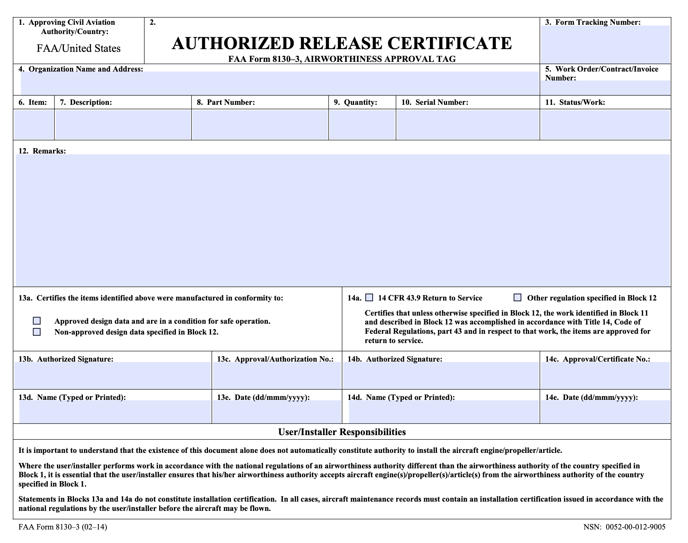
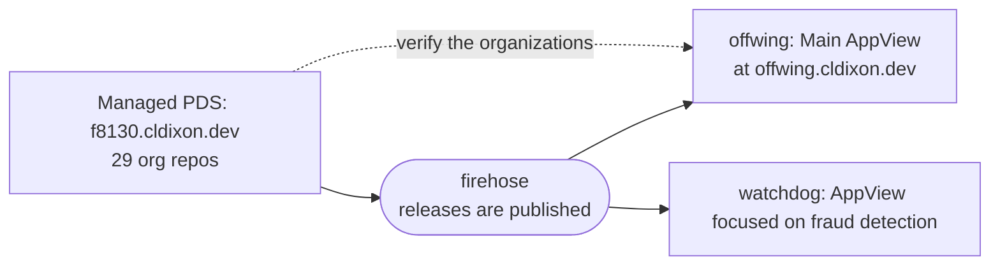

# Offwing: 8130 certificates on AT Protocol

⚠️ THIS IS A PROOF-OF-CONCEPT FOR DEMONSTRATION ONLY. ALL DATA IS SYNTHETIC.

**Offwing** is a demonstration of building on AT Protocol to solve interesting problems beyond social media apps.

You can explore the [live app](https://offwing.cldixon.dev) to try it out and read the [blog post](https://cldixon.com/blog/offwing) for more background.

## The concept

Whenever parts are removed from an aircraft and shipped to outside repair vendors, they must be tracked with an accompanying FAA 8130-3 document (or variation depending on regulatory authority). When a part is sold on secondary markets, its entire history must be accounted for by its lineage of these documents. Yet, most players in the aviation maintenance industry keep these documents in paper and PDF formats.



At best, this leads to inefficiencies and unavailability of critical data for operators. In worse cases, it has been susceptible to fraud and fabrication. One challenge is that these documents do include some amount of proprietary information, such as notes on the repairs taken and outcome. Neither the repair vendor nor the operators want this information to be publicly visible. Other information in the documents, such as part number, serial number, etc., could be made public and are essential later in the verifying that a part has all of its historical 8130 documents accounted for.

This application provides a proof of concept for a decentralized, secure, and transparent solution to this problem. The AT Protocol provides a way for participants to share information while maintaining ownership and privacy for sensitive proprietary data. Cryptographic signatures are generated from the data entered into a released 8130 certificate and published onto a public network under the identity of the vendor in possession of the part.

When the receiver inspects the returned parts package, they can verify the included 8130 paper copy matches the original record from the sender. Optionally, the recipient has the ability to publicly attest to the record, which provides positive a postive signal to the network for distinguishing valid activity from fraudulent behavior.


## AT Proto architecture

Four moving parts, and how they reach each other.




## The lexicon

There are multiple record types in the offwing lexicon, all under `dev.cldixon.f8130`. See them all in [`lexicons/`](lexicons/dev/cldixon/f8130).

Here, you can see the core record type, **`release`**, which represent an 8130-3 document.

The most critical field here is the `commitment`, which is a cryptographic signature generated from the contents of the official released document (including the sensitive fields). The receiver of the released part can verify perfect accuracy by recomputing the commitment from the paper document received with the part. While **Offwing** can generate and verify these commitments, the architecture as designed supports organizations developing their own verification app.

An important note here is that the _sensitive information_ included in an 8130 document is never published to the network. The generated cryptographic signature is published to the network, and downstream verifiers will have the 8130 paper copy to verify against it. When the verification step fails, the algorithm can only state that the records don't match; it can't specify which fields are mismatched.


```json
{
  "lexicon": 1,
  "id": "dev.cldixon.f8130.release",
  "defs": { "main": {
    "type": "record",
    "key": "tid",
    "record": {
      "type": "object",
      "required": ["commitment", "issuerDid", "approvingAuthority", "formNumber",
                   "organizationName", "organizationAddress", "description",
                   "partNumber", "serialNumber", "signerCert", "completedAt"],
      "properties": {
        "commitment":          { "type": "bytes",   "minLength": 32, "maxLength": 32 },
        "fieldSetVersion":     { "type": "integer", "minimum": 1 },
        "issuerDid":           { "type": "string",  "format": "did" },
        "prev":                { "type": "ref",     "ref": "com.atproto.repo.strongRef" },
        "subject":             { "type": "string",  "maxLength": 512 },
        "approvingAuthority":  { "type": "string",  "maxLength": 128 },
        "formNumber":          { "type": "string",  "maxLength": 128 },
        "organizationName":    { "type": "string",  "maxLength": 256 },
        "organizationAddress": { "type": "string",  "maxLength": 512 },
        "description":         { "type": "string",  "maxLength": 256 },
        "partNumber":          { "type": "string",  "maxLength": 128 },
        "serialNumber":        { "type": "string",  "maxLength": 128 },
        "signerCert":          { "type": "string",  "maxLength": 128 },
        "completedAt":         { "type": "string",  "format": "datetime" }
      }
    }
  }}
}
```

| field | 8130-3 block | |
|---|---|---|
| `approvingAuthority` | 1 | approving civil aviation authority and country |
| `formNumber` | 3 | form tracking number |
| `organizationName`, `organizationAddress` | 4 | the issuing organization — already implied by whose repo this is |
| `description` | 7 | what the item is |
| `partNumber` | 8 | |
| `serialNumber` | 10 | |
| `signerCert` | 13c / 14c | the approval or certificate number released under |
| `completedAt` | 13e / 14e | claimed completion — attacker-controlled, compare against an observer's own clock |

## Conclusion

If you are interested in discussing this project, please reach out to me through my blog or GitHub.
