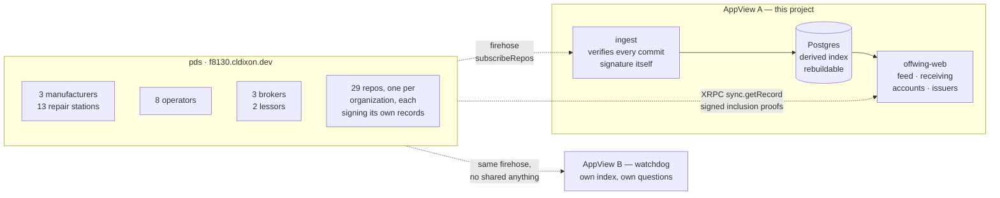
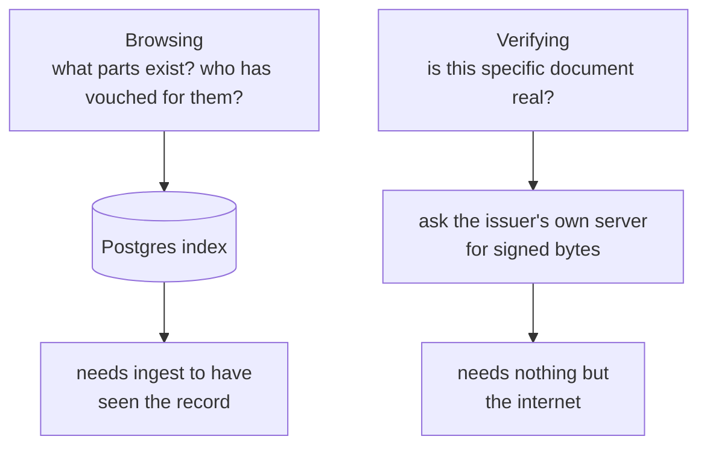
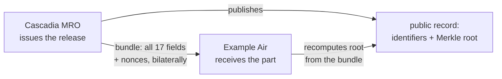

# OffWing — verifiable release certificates on AT Protocol

> ## ⚠️ ALL DATA IN THIS REPOSITORY IS SYNTHETIC
>
> Fictional organizations, fictional CAGE codes, non-existent part numbers.
> Nothing here is an airworthiness record, and nothing here is an accepted
> scheme for one. FAA AC 120-78A permits electronic records and signatures,
> but a DID-signed record is **not** an approved method. This is a protocol
> demonstration and must never be presented as an airworthiness system.

A demonstration that FAA 8130-3 Authorized Release Certificates, and the
back-to-birth traceability behind them, can be made cryptographically
verifiable using AT Protocol as the identity, storage, and distribution
layer — while disclosing none of the commercially sensitive contents.

## The idea

**Publish a commitment, deliver the document.**

The real failure mode in aviation parts fraud is not tampering with shared
records. It is forgery at the source: documents attributed to real, reputable
repair stations that never issued them. So a repair station's atproto handle
*is* its domain, DNS-verified, and its records are signed by keys in its DID
document. A release certificate is valid only if a matching commitment record
exists in the issuer's own repo. Forging one requires compromising the
station's domain *and* its signing key, not editing a PDF.

The commitment covers **every block of the form** — a Merkle root over all
seventeen. The public record carries nine of them, enough to find a record and
know who signed it. The rest, including Block 11 (what was done) and Block 12
(what the shop found), travel bilaterally as a "bundle," exactly as paperwork
moves today. Anyone can verify authorship and integrity; nobody learns the
commercially sensitive content.

Completeness stays public even when contents are not. Each release links its
predecessor, so a seller can withhold a document but cannot hide that the
chain fails to reach birth.

The **form view** puts one record in three notations side by side: the
8130-3 as a shop would recognise it, the AT Protocol record as published, and
the commitment tree. Click a block and its leaf folds up to the published root.
Without a bundle, nine blocks have values and eight say *withheld* — which is
the design, drawn.

[**docs/commitments.md**](docs/commitments.md) works the cryptography through
from first principles — a four-field toy tree with reproducible hashes, why the
nonces are not optional, how one field is opened against the published root
without the issuer's involvement, and what the scheme still cannot do.

## Only positive claims

The network carries one statement about a document — that somebody held it and
it checked out — and deliberately has no counterpart for a failure.

That is not squeamishness. **A mismatch cannot be proven to a third party.** To
show that a document does not recompute you would have to reveal the document,
and a document that fails proves only that *some* document fails — anyone can
produce one. Selective disclosure proves a value is under a commitment; there
is no symmetric move for proving one is not. A public rejection would
therefore be an unprovable accusation of fraud against a named business,
published by a party with a commercial interest in the outcome. No reputable
operator would touch it, and a system that invites it is a defamation engine
rather than a transparency tool.

So an operator who cannot verify a certificate takes it up with the station
privately, exactly as they do now. The absence of attestations on a station's
releases is weak evidence and nothing more, which is the correct strength for
it — most checks in a real supply chain are never announced at all.

What is left turns out to be the stronger material. A station cannot decline to
participate in a check it is not being asked to make, so arithmetic over what
issuers published themselves — one serial with two origin claims, a history
that stops at a record nobody can produce — needs nobody's cooperation.

## Receiving a part

Issuing is half of it. The other half is somebody on a loading dock with a
crate, and the demonstration models that end too.

A release hands the part to a recipient along with the paperwork — in the
model, the bundle travels in the box, as a code printed beside the form. That
is the only way a receiver could ever open the withheld blocks, and it costs
nothing: the paper already has all seventeen printed on it, so a code carrying
the same values reveals nothing to anyone holding the crate that the crate did
not already reveal.

**Receiving** is then one page in three states. The scanned certificate, drawn
as the form. The seven checks, running. The outcome, appended below rather
than replacing what came before, so the whole thing can be scrolled back
through afterwards.

The checks are real — the issuer's DID resolved, their repository fetched, the
commit signature verified against the key their DID document declares, the
document recomputed against the commitment. What is spared the visitor is the
typing, not the arithmetic. A third of arrivals carry an altered field, so
both outcomes are reachable without hunting for one.

A failure teaches which half of the form it landed in. A public block can be
named outright — the record says one thing, the crate says another. A withheld
block cannot: the commitment is a single hash over all seventeen and does not
decompose, so the honest answer is that the document is not the one that was
published and nobody can say which line changed. That second case is the one
people find surprising and it is the shape of the guarantee.

A document that checks out can be attested to, optionally. A document that
does not offers nothing to publish, for the reason above.

## Synthetic activity

The demonstration writes itself. While anybody is watching the feed, a
generator issues releases, ships them to recipients, and publishes
attestations — real records, really signed, into real repositories.

Block 7 and Block 12 are narrated by Claude Sonnet when `ANTHROPIC_API_KEY` is
set, and come from a built-in catalogue when it is not; the caller cannot tell
which, and both are valid seventeen-block forms. Every identifier, date and
regulatory field is composed by code rather than by the model — a part number
is derived from an invented prefix registry, which removes the entire class of
"the model invented a real part number" from a system that publishes
permanently.

## Architecture

The load-bearing line in this diagram is the dashed one. Everything to its
right reads the repositories **only** over XRPC and the firehose — never the
PDS's disk or database, even though they run in the same Railway project.
Break that once and the demonstration becomes a normal database with extra
steps.



Two paths run through the app, and they are genuinely independent:



Verification consults **no database**. It resolves the handle through DNS,
asks that issuer's PDS for a signed record proof, recomputes the commitment
from the document in your hand, then follows `prev` references to birth —
crossing whatever servers the chain happens to span. The index exists purely
for discovery, which is why the app still verifies documents correctly with
`DATABASE_URL` unset.

And the document itself never touches this system at all:



Blocks 11 and 12 travel shop-to-customer exactly as paperwork does today. The
public record carries what identifies the document and who issued it, plus a
commitment over the whole of it. Anyone can check authorship and integrity;
nobody learns what was done to the part — and no AppView ever stores a bundle.

## Status

Complete as a demonstration. Built:

| | |
|---|---|
| `lexicons/` | `release`, `attestation`, `station` record schemas |
| `core/` | TypeScript commitment core and the seven-stage verification pipeline |
| `commitment/` | Go implementation of the same commitment scheme |
| `ingest/` | firehose consumer, signature verification, derived Postgres index |
| `cmd/ingest/` | `run` and `reindex` commands |
| `web/` | the AppView — feed, receiving, form view, part timeline, accounts, issuers, JSON API |
| `seed/` | one-shot job: 29 fictional organizations and the eight set pieces |
| `watchdog/` | AppView B — an independent reader with its own index and its own questions |
| `testdata/vectors.json` | the cross-language contract both cores must satisfy |
| `spike/` | validation that the atproto verification primitives hold up |
| `docs/commitments.md` | the commitment scheme explained, with worked examples |

Running live on Railway with real repositories, real signing keys and real
`did:plc` identities, both AppViews reading them, issuance and attestation
through the UI, and selective disclosure. Every milestone from the original
plan is built.

Deliberately not built, and documented as gaps rather than quietly fixed:
individual counter-signing, aircraft logbooks, revocation, and nonce
custody — see [Known gaps](#known-gaps).

Run it locally with nothing installed and nothing deployed:

```bash
npm install
npm run dev                             # http://localhost:3000
curl localhost:3000/demo/bundles.json   # genuine, tampered, forged
```

Demo mode serves an in-memory network of real repositories with real signing
keys and real inclusion proofs. Paste the `tampered` bundle into the verify
page to see the moment the design is built around: a genuine signature beside
a commitment that no longer matches.

### How it is painted

The interface has one design system and every screen is drawn from it:

| | |
|---|---|
| `web/src/styles/tokens.css` | the vocabulary — palette for light and dark, type scale, radii, spacing, shadows, motion |
| `web/src/styles/app.css` | the components, written only in terms of those tokens |

Neither the templates nor `app.css` carry a colour, typeface, size or radius of
their own; to change how something looks, change the token. The two files are
read once at startup and inlined into every page, so a page is still a single
request and there is no build step. The fonts — Barlow Condensed for display,
Barlow for text, Space Mono for every identifier — are the one thing fetched
from elsewhere, and each has a system fallback.

```bash
npm install && npm test        # TypeScript: commitment core + verification pipeline
go test ./commitment/          # Go core, against the same vectors

# Database tests need a live PostgreSQL; without the variable they skip.
F8130_TEST_DSN='postgres://...' go test ./ingest/
```

## Deployment

Eight services in one Railway project:

| service | role | address |
|---|---|---|
| `pds` | the stations' repositories — the data | `f8130.cldixon.dev` |
| `ingest` | firehose consumer; verifies every commit signature | private |
| `Postgres` | derived index, rebuildable from the firehose | private |
| `offwing-web` | AppView A — feed, receiving, verify, trace | [offwing.cldixon.dev](https://offwing.cldixon.dev) |
| `seed` | one-shot job; provisions accounts and scenarios | — |
| `watchdog-ingest` | AppView B's own consumer, over the **public** firehose | private |
| `Postgres-8BEk` | AppView B's own index | private |
| `watchdog` | AppView B — contradictions between published records | [watchdog-production-7c07.up.railway.app](https://watchdog-production-7c07.up.railway.app) |

The two AppViews share the record schemas and nothing else: no database, no
code, no API, no agreement. AppView B connects to
`wss://f8130.cldixon.dev` over the public internet rather than through
Railway's private network, because a reader with privileged access would not
be demonstrating anything. It backfills from the start of the log, so it can
join late and still see everything.

The two answer different questions and no platform arbitrates between them. A
release verifies **cleanly in A** — the certificate really was signed by the
organization claiming it — while B can see that the same part and serial is
claimed as new by two different stations, which is a contradiction neither
record admits on its own. Both readings are correct.

B accuses nobody. It reports arithmetic over what issuers published
themselves: serials with more than one origin claim, histories that stop at a
record nobody can produce, and how much of each issuer's output anybody has
independently vouched for — as two numbers rather than a score, because thin
coverage usually means nobody got round to publishing a check.

`f8130.cldixon.dev` serves the AT Protocol PDS, not a user interface — that
separation is the point. The five handles are subdomains of it, so
`northwind-turbine.f8130.cldixon.dev/.well-known/atproto-did` returns that
organization's DID.

**A deployment with no environment variables set comes up correct.** That is a
deliberate property, not luck. Recreating a Railway service silently drops every
variable it had, and the first time that happened here the app booted green,
served every page, and failed every verification — because it was pointed at the
real network with no PDS behind it. Broken-but-healthy-looking is the worst
failure mode available, so the zero-configuration case is now the default and is
covered by tests.

| variable | default | effect |
|---|---|---|
| `F8130_MODE` | `demo`, or `live` when `DATABASE_URL` is set | which network to read |
| `DATABASE_URL` | unset | enables browsing; verification never needs it |
| `PDS_INTERNAL_URL` | unset | where to sign; without it the app is read-only |
| `SEED_ACCOUNT_PASSWORD` | unset | the demonstration accounts' password, for signing |
| `ANTHROPIC_API_KEY` | unset | narrates Blocks 7 and 12; falls back to the catalogue |
| `F8130_ACTIVITY` | on in demo, off in live | the synthetic generator; `1` forces on, `0` off |
| `PORT` / `HOST` | `3000` / `::` | IPv6 first, falls back to IPv4 |
| `PLC_URL` | `plc.directory` | identity directory, live mode only |
| `PDS_HOSTNAME` | `f8130.cldixon.dev` | the domain the roster's handles sit under |

**Live mode is checked rather than believed.** Asking for `live` with no PDS
behind it used to start the app anyway: no writer, so no issuance and no
activity, and an index with nothing in it. Every page rendered and the feed was
empty — broken but healthy-looking, the failure this section opens by warning
about. The PDS is now probed once at boot, and if it does not answer the
process runs the self-contained demonstration instead, which needs neither a
PDS nor a database.

Production is the exception and never falls back: a real deployment whose PDS
is briefly down must not quietly start serving invented records from its own
domain. `RAILWAY_ENVIRONMENT_NAME` tells them apart, because the platform sets
it per environment and it is the one thing a preview does not inherit.

That is what makes pull-request previews work. They are cloned from production
carrying `F8130_MODE=live` and without the `pds` service, and every one of them
served an empty feed until the probe existed.

A demo instance says so in the UI and on `/api/health`, so an instance serving
an in-memory network can never be mistaken for one reading the real thing.

Configuration that matters, recorded because it was not obvious:

- **`railway.json` points the build at `web/Dockerfile`.** This repository holds
  a Node workspace and a Go module side by side, and Railway's build detection
  finds `go.mod` at the root first — an early deploy attempt built the Go
  service by mistake and failed fetching a Go toolchain. Each service declares
  its own Dockerfile rather than relying on detection. (Setting
  `RAILWAY_DOCKERFILE_PATH` achieves the same thing if the config file is ever
  not picked up.)
- Autodeploy needs the Railway GitHub App to have access to this repository,
  granted at github.com/settings/installations. Changing any service variable
  also forces a rebuild from the branch head.

## The demonstration data

Twenty-nine fictional organizations — 3 manufacturers, 13 repair stations,
8 operators, 3 brokers, 2 lessors — writing releases and attestations into
their own repositories. The seed writes eight set pieces; a generator keeps
adding ordinary traffic for as long as anybody is watching the feed.

The set pieces exist to make specific things visible:

| | what it shows |
|---|---|
| **Complete history** | a fuel control unit from manufacture to overhaul, accepted by its operator |
| **Tampered / forged** | fixtures, never published — a genuine signature over an altered document, and a document naming a record that does not exist |
| **The orphan** | a correctly signed release whose predecessor was never published |
| **The broker** | three impeccable releases that nobody has ever checked — clean in A, and thin coverage in B, which is weak evidence and reported as such |
| **The deep chain** | 7 shop visits, 6 organizations, 4 successive owners, 2009 to 2026, reaching birth |
| **The vanished station** | a trace that dies at an issuer whose identity does not resolve at all |
| **Ordinary traffic** | 11 unremarkable parts, because a demonstration where every record is a scandal teaches the wrong prior |

The last two failure modes are deliberately different and a buyer needs to tell
them apart. The orphan says *this record is missing*; the vanished station says
*the organization that would hold it cannot be found*. One is an unresolvable
record key under a live identity, the other a well-formed `did:plc` that was
never registered, so resolution is genuinely attempted and genuinely fails.

Organizations publish their own `station` profile — display name, role, CAGE
code — so an AppView learns the cast by reading the network rather than from a
table it hardcoded. None of it is committed to by any release: what a shop
calls itself is not a property of the work it certified.

Nothing in this roster is real. CAGE codes are seven characters, so they cannot
collide with a real five-character code however the cast grows.

## Two implementations on purpose

The commitment scheme is meant to be implementable from its specification
alone. The only way to know whether it actually is — rather than having
quietly encoded a JavaScript quirk — is to write it twice and make both agree
byte for byte.

That has already earned its keep. JavaScript's `\s` matches non-breaking
spaces, Unicode space separators, and the BOM; Go's matches five ASCII
characters. A form pasted out of a spreadsheet would have canonicalized
differently in the two languages, and the disagreement would have surfaced
much later as an unverifiable document rather than as an error.

## Design notes

- **Field order is schema.** Changing the order, membership, or normalization
  of the committed field set changes every root ever produced. Versioned,
  never edited.
- **Nonces are non-negotiable.** 8130-3 fields are extremely low entropy — a
  status is one of five values. An unsalted commitment is brute-forced
  instantly by anyone holding the root.
- **Domain separation prefixes are mandatory.** Without them an internal node
  can be presented as a leaf.
- **Null and absent are identical; an empty string is neither.** A shop that
  wrote nothing in the remarks box committed to an empty remarks box, which is
  a different claim from having no remarks field.
- **Bundles never touch server storage.** Holding them would rebuild the
  central repository of sensitive data the design exists to avoid.

## Known gaps

Stated rather than silently fixed:

- **Nonce custody is unsolved.** Lose the bundle and the part becomes
  unverifiable even though the commitment stands. Production would need
  escrow or deterministic nonce derivation from a station-held secret.
- **Timestamps are claims.** `completedAt` is attacker-controlled; a
  self-hosted PDS can backdate. Only an independent observer's recorded time
  means anything, and one observer is a partial defense at best.
- **No revocation flow** for a release whose issuer is later decertified.
- **`signerCert` is a string**, not a DID reference. Individual
  counter-signing and aircraft logbooks are documented extensions,
  deliberately not built.
- **Nothing binds a DID to a certificated repair station.** Anyone can
  register a DID, publish a station profile claiming any certificate number,
  and issue certificates that verify flawlessly. Verification proves *the
  entity controlling this DID signed this*, not that the entity is who it says
  it is. A real system needs an authority — the FAA or an equivalent —
  publishing the binding. This is the largest gap, and it is why a green check
  in this application must never be read as airworthiness.
- **The document never authenticates the part.** Photocopy a genuine
  certificate and its bundle, attach them to a counterfeit component with a
  restamped dataplate, and every check passes. No paperwork scheme, digital or
  otherwise, can close this; it is why the verified screen says so.

## Credits

Design and specification by [@cldixon](https://github.com/cldixon).
